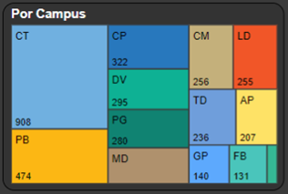

**EM ELABORAÇÃO!**

# Tipos de Visuais {.tabset .tabset-fade}

## Nativos {.tabset .tabset-fade}

### Waffle Chart

Usa do visual nativo **matriz** 

### Mapa de Formas

Usa do visual nativo **mapa de formas** 

Depende de **ativação** dessa opção

Em Arquivo > Opções e configurações > Opções > Recursos de visualização > Moldar visual do mapa

### Treemap

Usa do visual nativo **treemap** 

## Personalizados {.tabset .tabset-fade}

### Sunburst

Usa o visual personalizado **sunburst** 

### Sankey Chart

Usa o visual personalizado **sankey chart** 

# Padrões de Formatação

# Padrões de Ícones

## Campi

|Img/Link|Campus|HEX|Exemplo|HEX Dalt.|Exemplo Dalt.|
|:-:|:--:|:-:|:-:|:-:|:-:|
|[{width=80px}](https://nuvem.utfpr.edu.br/index.php/s/gKnodkJIC46NaeT)|Apucarana|#FCDF9B|⬤|#F5F534|▦|
|[{width=80px}](https://nuvem.utfpr.edu.br/index.php/s/yZGN57i8CKyqgX7)|Campo Mourão|#FCB000|⬤|#F5F534|▨|
|[{width=80px}](https://nuvem.utfpr.edu.br/index.php/s/9i2LHSURG9EIOt6)|Cornélio Procópio|#F3592A|⬤|#F5F534|▩|
|[{width=80px}](https://nuvem.utfpr.edu.br/index.php/s/zQ4VkzhNvZmXuU5)|Curitiba|#EB2100|⬤|#B5B5D4|▦|
|[{width=80px}](https://nuvem.utfpr.edu.br/index.php/s/gUpv1qTDghoWg48)|Dois Vizinhos|#A6CBE6|⬤|#B5B5D4|▨|
|[{width=80px}](https://nuvem.utfpr.edu.br/index.php/s/mrgHeK7fwXlGLwh)|Francisco Beltrão|#268EF0|⬤|#B5B5D4|▩|
|[{width=80px}](https://nuvem.utfpr.edu.br/index.php/s/cCltKc6FDZ2qbHg)|Guarapuava|#D0B5AF|⬤|#7979FB|▦|
|[{width=80px}](https://nuvem.utfpr.edu.br/index.php/s/J2brXLIB2Kfj570)|Londrina|#A9D08E|⬤|#7979FB|▨|
|[{width=80px}](https://nuvem.utfpr.edu.br/index.php/s/a3Rs4thIeOI1iUd)|Medianeira|#3EC1A9|⬤|#7979FB|▩|
|[{width=80px}](https://nuvem.utfpr.edu.br/index.php/s/gGg4pxCyoyeUKIX)|Pato Branco|#8525F1|⬤|#FFFFFF|▦|
|[{width=80px}](https://nuvem.utfpr.edu.br/index.php/s/UKsV7twQVX0mWoC)|Ponta Grossa|#A7194B|⬤|#FFFFFF|▨|
|[{width=80px}](https://nuvem.utfpr.edu.br/index.php/s/GSlf0q1wBss1KCL)|Reitoria|#108372|⬤|#FFFFFF|▩|
|[{width=80px}](https://nuvem.utfpr.edu.br/index.php/s/lhGFJxiIJmMFiey)|Santa Helena|#E8F275|⬤|#B2B22E|▦|
|[{width=80px}](https://nuvem.utfpr.edu.br/index.php/s/fZoBqVEN51V6tkq)|Toledo|#E651DA|⬤|#B2B22E|▨|

## Ensino {.tabset .tabset-fade}

### Geral

|Img/Link|Semântica|Tipo|Nome/Fonte|HEX|
|:-:|:--:|:--:|:--:|:-:|
|[{width=40px}](https://nuvem.utfpr.edu.br/index.php/s/WS2AuV1xYoL6Bcp)|Ativos/Regulares|Font Awesome LaTeX|[faBook](https://linorg.usp.br/CTAN/fonts/fontawesome/doc/fontawesome.pdf)|#0EB194|
|[{width=40px}](https://nuvem.utfpr.edu.br/index.php/s/c6dcpRHIWFAABLk)|Formados|Font Awesome|[fa-user-graduate](https://fontawesome.com/icons/user-graduate?f=classic&s=solid)|#1D4999|
|[{width=65px}](https://nuvem.utfpr.edu.br/index.php/s/9xZAQckhLeF05aQ)|Desistentes/Evadidos|Font Awesome|[fa-person-running](https://fontawesome.com/icons/person-running?f=classic&s=solid) + [fa-door-open](https://fontawesome.com/icons/door-open?f=classic&s=solid)|#BE5108|
|[{width=50px}](https://nuvem.utfpr.edu.br/index.php/s/cwoGvXt5GPLCmtn)|Estudantes|Font Awesome|[fa-users](https://fontawesome.com/icons/users?f=classic&s=solid)|#FF8800|
|[{width=45px}](https://nuvem.utfpr.edu.br/index.php/s/VjpONRmk2d9rntC)|Cursos|Font Awesome|[fa-pencil](https://fontawesome.com/icons/pencil?f=classic&s=solid)|#3DAD00|
|[{width=45px}](https://nuvem.utfpr.edu.br/index.php/s/nYcApdt8FRrCQKt)|Candidatos|Font Awesome|[fa-hand-point-up](https://fontawesome.com/icons/hand-point-up?f=classic&s=solid)|#00E1FF|
||Vagas|Font Awesome|[fa-chair](https://fontawesome.com/icons/chair?f=classic&s=solid)|#FFAE00|

### Áreas SESU

Tais ícones foram usados no visual personalizado Facet Key  (**descontinuado**) da parte de Cursos e Programas. Caso use o visual, o próprio Power BI os gera a partir do nome do ícone.

|Img/Link|Semântica|Tipo|Nome/Fonte|HEX|
|:-:|:--:|:--:|:--:|:-:|
||ENG/Engenharias|Font Awesome Facet Key|[fa fa-gear](https://fontawesome.com/icons/gear?f=classic&s=solid)|#FF001F|
||CA/Ciências Agrárias|Font Awesome Facet Key|[fa fa-leaf](https://fontawesome.com/icons/leaf?f=classic&s=solid)|#108372|
||A/Artes|Font Awesome Facet Key|[fa fa-paint-brush](https://fontawesome.com/icons/paint-brush?f=classic&s=solid)|#0EB194|
||LL/Linguística e Letras|Font Awesome Facet Key|[fa fa-pencil](https://fontawesome.com/icons/pencil?f=classic&s=solid)|#FCB714|
||CE2/Ciências Exatas - Computação|Font Awesome Facet Key|[fa fa-laptop](https://fontawesome.com/icons/laptop?f=classic&s=solid)|#DB00B0|
||TEC/Tecnólogos|Font Awesome Facet Key|[fa fa-wrench](https://fontawesome.com/icons/wrench?f=classic&s=solid)|#FF8000|
||CE1/Ciências Exatas - Matemática e Estatística|Font Awesome Facet Key|[fa fa fa-calculator](https://fontawesome.com/icons/calculator?f=classic&s=solid)|#95AF00|
||CSA/Ciências Sociais Aplicadas|Font Awesome Facet Key|[fa fa-briefcase](https://fontawesome.com/icons/briefcase?f=classic&s=solid)|#70B0E0|
||CSC/Arquitetura/Urbanismo|Font Awesome Facet Key|[fa fa-building](https://fontawesome.com/icons/building?f=classic&s=solid)|#2878BD|
||CS4/Enfermagem, Fisioterapia, Fonaudiologia|Font Awesome Facet Key|[fa fa-stethoscope](https://fontawesome.com/icons/stethoscope?f=classic&s=solid)|#C4B07B|
||CS2/Veterinária, Odontologia, Zootecnia|Font Awesome Facet Key|[fa fa-paw](https://fontawesome.com/icons/paw?f=classic&s=solid)|#F15628|
||CB/Ciências Biológicas|Font Awesome Facet Key|[fa fa-flask](https://fontawesome.com/icons/flask?f=classic&s=solid)|#AF916D|
||CET/Ciências Exatas e da Terra|Font Awesome Facet Key|[fa fa-line-chart](https://fontawesome.com/icons/line-chart?f=classic&s=solid)|#1BBB6A|
||ME/Mestrado|Font Awesome Facet Key|[fa fa-book](https://linorg.usp.br/CTAN/fonts/fontawesome/doc/fontawesome.pdf)|#AC8000|
||DR/Doutorado|Font Awesome Facet Key|[fa fa-book](https://linorg.usp.br/CTAN/fonts/fontawesome/doc/fontawesome.pdf)|#B44AE7|

## Assistência Estudantil

|Img/Link|Semântica|Tipo|Nome/Fonte|HEX|
|:-:|:--:|:--:|:--:|:-:|
||Auxílio Alimentação|Font Awesome|[fa-utensils](https://fontawesome.com/icons/utensils?f=classic&s=solid)|#FFA400|
||Auxílio Básico|Font Awesome|[fa-hand-holding-dollar](https://fontawesome.com/icons/hand-holding-dollar?f=classic&s=solid)|#FFEE00|
||Auxílio Moradia|Font Awesome|[fa-house](https://fontawesome.com/icons/house?f=classic&s=duotone)|#A1BBD4/ #145692|
||Auxílio Emergencial|Font Awesome|[fa-truck-medical](https://fontawesome.com/icons/truck-medical?f=classic&s=solid)|#FF0000|
||Auxílio de Inclusão Digital|Font Awesome|[fa-mobile-screen-button](https://fontawesome.com/icons/mobile-screen-button?f=classic&s=solid)|#5862FF|

## Relatório de Gestão

|Img/Link|Semântica|Tipo|Nome/Fonte|HEX|
|:-:|:--:|:--:|:--:|:-:|
|[{width=75px}](https://nuvem.utfpr.edu.br/index.php/s/G030ACxUq17TV9z)|Ensino Fundamental|Font Awesome|[fa-chalkboard](https://fontawesome.com/icons/chalkboard?f=classic&s=solid) + [fa-apple-whole](https://fontawesome.com/icons/apple-whole?f=classic&s=solid)|#7F3300/#16663F/ #CC5100/#FF0000/#00DB00|
|[{width=75px}](https://nuvem.utfpr.edu.br/index.php/s/AUP8DV4CJgQBBqz)|Ensino Médio|Font Awesome|[fa-chalkboard](https://fontawesome.com/icons/chalkboard?f=classic&s=solid) + [fa-function](https://fontawesome.com/icons/function?f=classic&s=solid)|#7F3300/#16663F/ #CC5100/#000000|
|[{width=70px}](https://nuvem.utfpr.edu.br/index.php/s/RZqihfY5ocFPkYS)|Técnico|Font Awesome|[fa-hammer](https://fontawesome.com/icons/hammer?f=classic&s=solid)|#8B8B8B/#5A3000|
|[{width=60px}](https://nuvem.utfpr.edu.br/index.php/s/5qw92y4eXeGhwCq)|Graduação/Graduado|Font Awesome|[faGraduationCap](https://linorg.usp.br/CTAN/fonts/fontawesome/doc/fontawesome.pdf)|#2878BD|
|[{width=65px}](https://nuvem.utfpr.edu.br/index.php/s/whbHKfeODncVr9k)|Especialização/Especialista|Font Awesome|[fa-radar](https://fontawesome.com/icons/radar?f=classic&s=regular)|#218000|
|[{width=55px}](https://nuvem.utfpr.edu.br/index.php/s/aFfxPDeYktMev9d)|Mestrado/Mestre/Dissertação|Font Awesome|[fa-book](https://fontawesome.com/icons/book?f=classic&s=solid)|#B31F1B|
|[{width=55px}](https://nuvem.utfpr.edu.br/index.php/s/mHBThdIH6OM0w53)|Doutorado/Doutor/Tese|Font Awesome|[fa-book-bookmark](https://fontawesome.com/icons/book-bookmark?f=classic&s=solid)|#C17E55/#441B00/ #FF0000/#D8D8D8|
